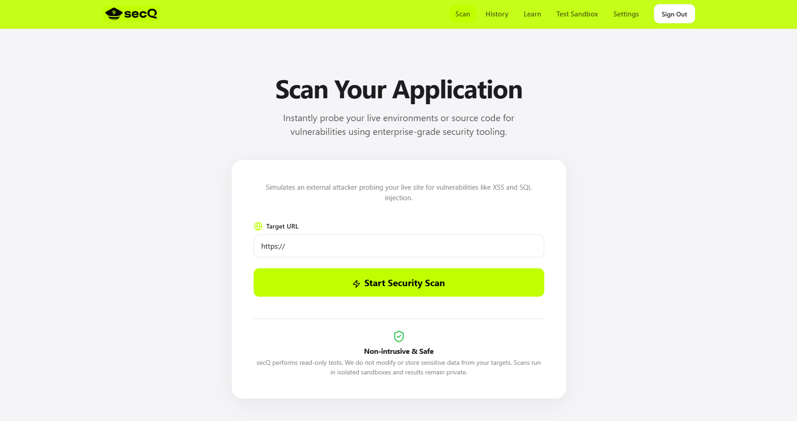
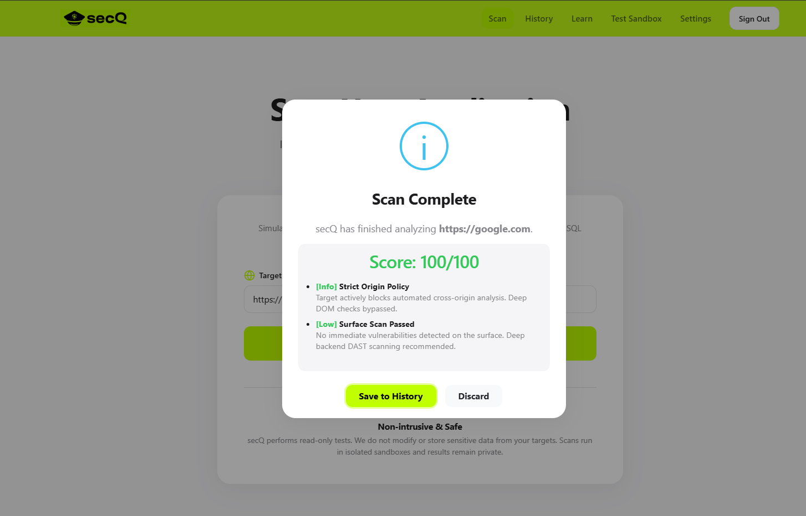

# secQ

A high-performance, non-intrusive Dynamic Application Security Testing (DAST) scanner designed for modern web applications.

## Preview

### Security Scan Interface
Instantly probe your live environments with our intuitive scanning interface.



### Scan Results & Analysis
Get clear, actionable security reports with specialized scoring and vulnerability breakdowns.



## Project Overview

secQ provides an enterprise-grade security auditing experience with a focus on simplicity and speed. It enables developers and security professionals to instantly probe live environments for vulnerabilities such as Cross-Site Scripting (XSS) and SQL Injection without the need for complex configuration.

Built with a "Safety-First" approach, secQ performs read-only tests in isolated sandboxes, ensuring that your production data remains untouched and secure while providing actionable insights into your application's security posture.

## Tech Stack


- **Frontend**: React 19, Vite, React-Bootstrap, Lucide Icons, Recharts
- **Worker**: Python 3.x, OWASP ZAP API integration
- **Database & Auth**: Supabase (PostgreSQL, GoTrue)
- **Styling**: SCSS / Custom Modern UI

## Structure

The project is divided into two main components: a modern React frontend and a Python-based security worker.

```text
secQ/
├── frontend/                # React Vite Application
│   ├── src/
│   │   ├── assets/          # Static assets and global styles
│   │   ├── components/      # Reusable UI components
│   │   ├── context/         # Authentication and Global State
│   │   ├── lib/             # API clients (Supabase)
│   │   └── pages/           # Application views (Scan, History, etc.)
│   └── vite.config.js       # Vite configuration
├── worker/                  # Python Security Worker
│   ├── main.py              # DAST scanning logic via OWASP ZAP
│   └── requirements.txt     # Python dependencies
├── screenshots/             # Project preview images
└── README.md                # Project documentation
```
